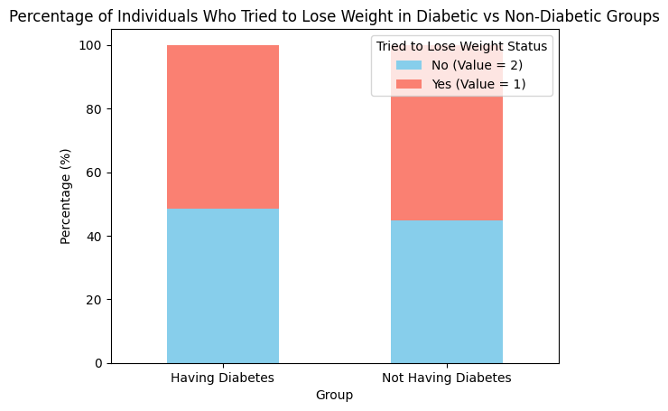
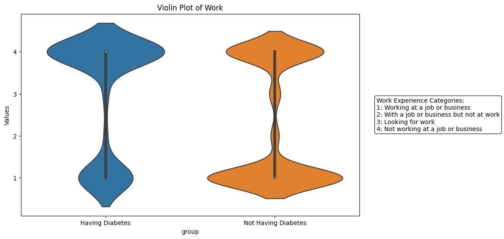
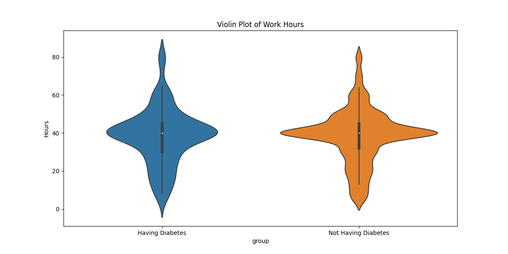
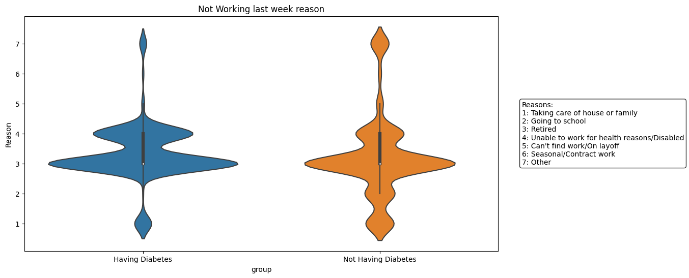
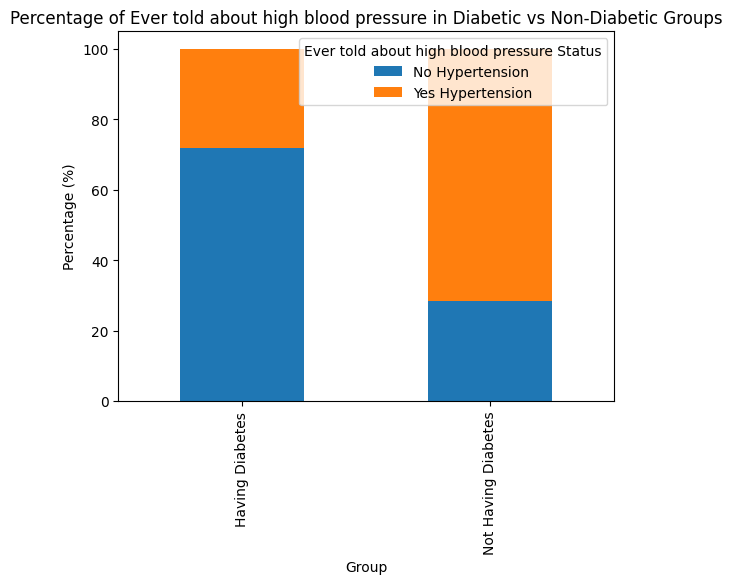
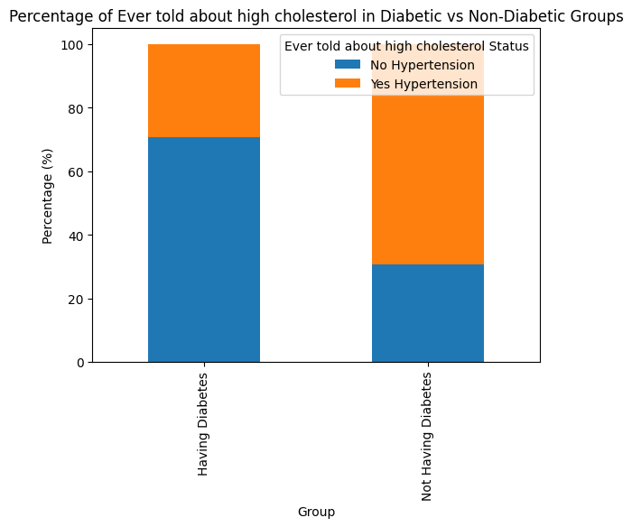

## Literature Review

### Attributes use for Diabetes Prediction

- [Optimization of diabetes prediction methods based on combinatorial balancing algorithm](https://www.nature.com/articles/s41387-024-00324-z#Tab1) Gender, Age, Hypertension, Heart_disease, Smoking_history, BMI, Glycated Hemoglobin Level, Blood Glucose Level

- [Diabetes Prediction using Machine Learning Algorithms](https://www.sciencedirect.com/science/article/pii/S1877050920300557) use Glucose Level, Blood Pressure, Skin Thickness(mm), Insulin ,BMI ,Age ,Job Type(Office-work/Fieldwork/Machine-work) 

## EDA 

### Weight History

#### BMI (Relative)

| Statistic | Diabetes            | Non Diabetes |
|-----------|---------------------|--------------|
| Mean      | 0.045443            | 0.039753     |
| Std       | 0.010822            | 0.009509     |
| Min       | 0.017637            | 0.016039     |
| 25%       | 0.037870            | 0.033287     |
| 50%       | 0.043945            | 0.037870     |
| 75%       | 0.050728            | 0.044343     |
| Max       | 0.112500            | 0.109261     |

#### Weight Change (Interquartile Range)

- For Diabetes, Weight Change - Q1: -15.0 and Q3: 0.0 
- For Non-Diabetes, Weight Change - Q1: -5.0 and Q3: 5.0

#### Tried to loss Weight

- For Diabetes, Tried to Lose Weight People Percentage: 48.54%
- For Non-Diabetes, Tried to Lose Weight People Percentage: 44.71%

It's almost equal percentage, not a good factor

### Occupation

#### Work Experience

People who are not working at a job or business are more prone to diabetes

#### Working Hours

Woking hours does not have much influence.
- Mean working hours of a person having diabetes = 38.465 hrs
- Mean working hours of a person not having diabetes = 38.667 hrs
- Average working days for people with diabetes in a week: 4.83
- Average working days for people without diabetes in a week: 4.81

#### Reasons of not working last week 

- Percentage of people with diabetes who are not working because of health issues:  31.32%

- Percentage of people without diabetes who are not working because of health issues:  16.84%

### Blood Pressure and Cholesterol

 - 72.041% of individuals with diabetes have been informed about hypertension.
 - Only 28.44% of individuals with no diabetes have been informed about hypertension.

 

 - 70.8% of individuals with diabetes have been informed about cholesterol.
 - Only 30.58% of individuals with no diabetes have been informed about hypertension.

 

#### Blood pressure medication

- Proportion of People with diabetes who are taking blood pressure medication: 0.9094
- Proportion of People without diabetes who are taking blood pressure medication: 0.7932

