# NHANES-Diabetes-Prediction

Welcome to the NHANES-Diabetes-Prediction repository! This project is a part of **Societal Challenges Datathon** course at **RWTH Aachen**. This project focuses on predicting whether an individual is at risk of diabetes using data from the **National Health and Nutrition Examination Survey** (NHANES) collected between August 2021 and August 2023. This repository includes Exploratory Data Analysis (EDA), Data Cleaning, Feature Selection and Engineering and Predictive Modeling.

## Table of Contents:

- [Usage](#usage)
- [Dataset](#dataset)
- [Literature Review](#literature-review)
- [EDA](#eda)
- [Preprocessing](#preprocessing-steps)
- [Results](#results)

## Usage

### Clone the repository
```
git clone https://github.com/BipanjitGill/Datathon
cd Datathon/
```

### Requirements

Installation of dependencies can be accomplished with:

```bash
pip install -r requirements.txt
```


## Dataset 

I have used the **National Health and Nutrition Examination Survey**(NHANES) Questionnaire and Demographic data. The data is freely available at the following link:
https://wwwn.cdc.gov/nchs/nhanes/search/datapage.aspx?Component=Questionnaire&Cycle=2021-2023

The directory structure for the dataset is as follows:

```bash
./  Datathon
├── raw_datasets
│   ├── acculturation.XPT
│   ├── alcohol_use.XPT
|   . 
|   . 
│   ├── weight_history.XPT
```


## Literature Review

### Attributes use for Diabetes Prediction

- [Optimization of diabetes prediction methods based on combinatorial balancing algorithm](https://www.nature.com/articles/s41387-024-00324-z#Tab1) use Gender, Age, Hypertension, Heart_disease, Smoking_history, BMI, Glycated Hemoglobin Level, Blood Glucose Level

- [Diabetes Prediction using Machine Learning Algorithms](https://www.sciencedirect.com/science/article/pii/S1877050920300557) use Glucose Level, Blood Pressure, Skin Thickness(mm), Insulin, BMI, Age, Job Type(Office-work/Fieldwork/Machine-work) 


## EDA 

### Demographic Analysis

<!-- #### Diabetes v/s Gender -->

|Gender |Percentage |
|------|------|
|Male| 48.06|
|Female|51.94|

#### Age 

Older individuals are more commonly affected by diabetes, while younger individuals tend to have a lower risk.

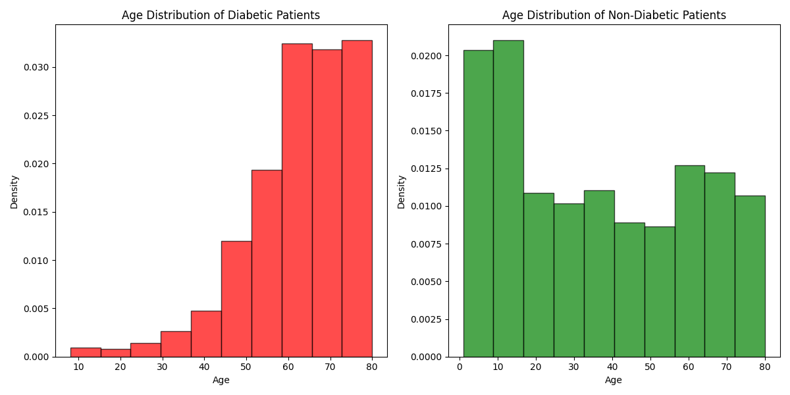

In the provided dataset, the distribution of diabetic cases among males and females across different age groups is similar.


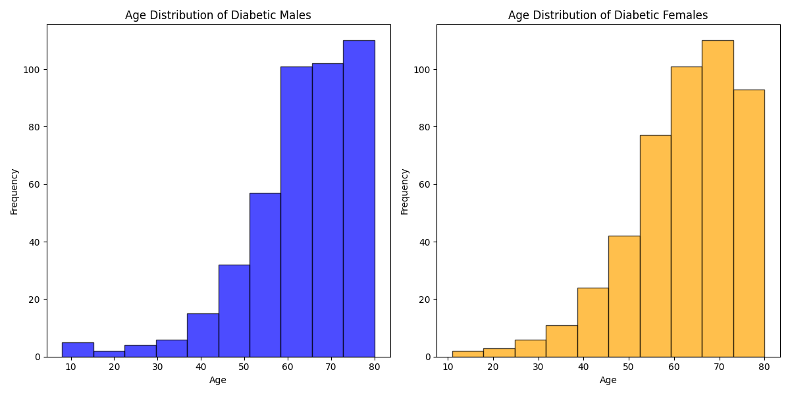

### Weight History

#### BMI (Relative)

| Statistic | Diabetes            | Non Diabetes |
|-----------|---------------------|--------------|
| Mean      | 0.045443            | 0.039753     |
| Std       | 0.010822            | 0.009509     |
| Min       | 0.017637            | 0.016039     |
| 25%       | 0.037870            | 0.033287     |
| 50%       | 0.043945            | 0.037870     |
| 75%       | 0.050728            | 0.044343     |
| Max       | 0.112500            | 0.109261     |

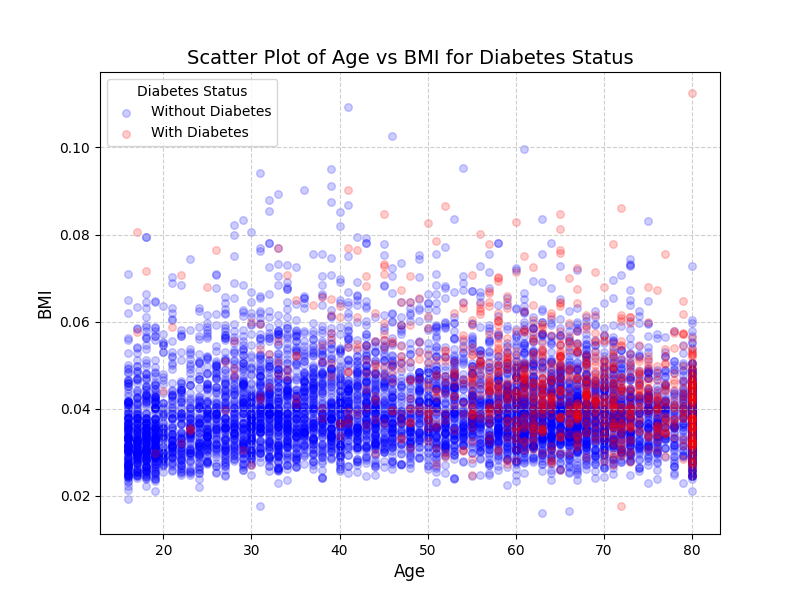 

The distribution of Age v/s BMI for diabetes patient is almost similar for both gender

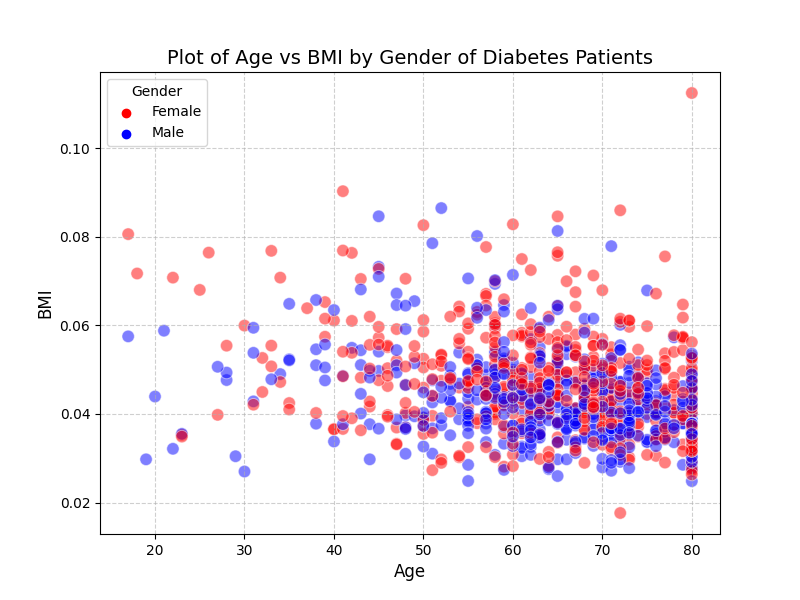 


#### Weight Change (Interquartile Range)

- For Diabetes, Weight Change - Q1: -15.0 and Q3: 0.0 
- For Non-Diabetes, Weight Change - Q1: -5.0 and Q3: 5.0

#### Tried to loss Weight

- For Diabetes, Tried to Lose Weight People Percentage: 48.54%
- For Non-Diabetes, Tried to Lose Weight People Percentage: 44.71%

It's almost equal percentage, not a good factor

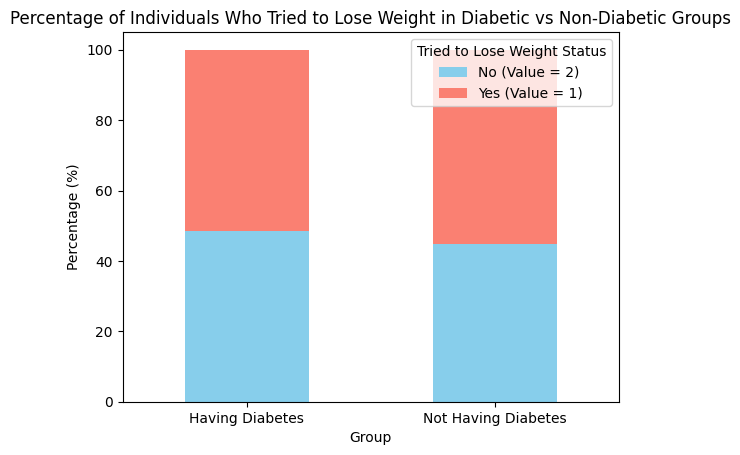

### Occupation

#### Work Experience

People who are not working at a job or business are more prone to diabetes

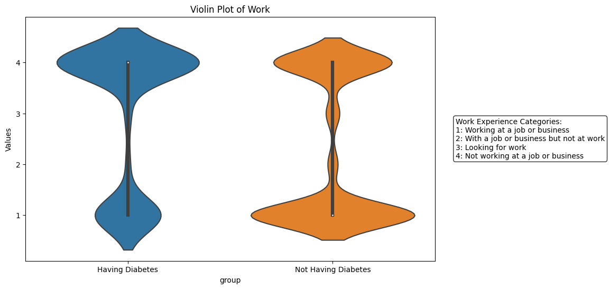

**Working at Job or Business** : Diabetes is more commonly observed among older individuals in this group.

**Not Working at Job or Business** : This group predominantly consists of older individuals. The average age is similar for both diabetic and non-diabetic individuals, but the interquartile range of age for diabetic patients is narrow, falling between 62 and 75 years. Both male and female who are suffering from diabetes have similar average age.

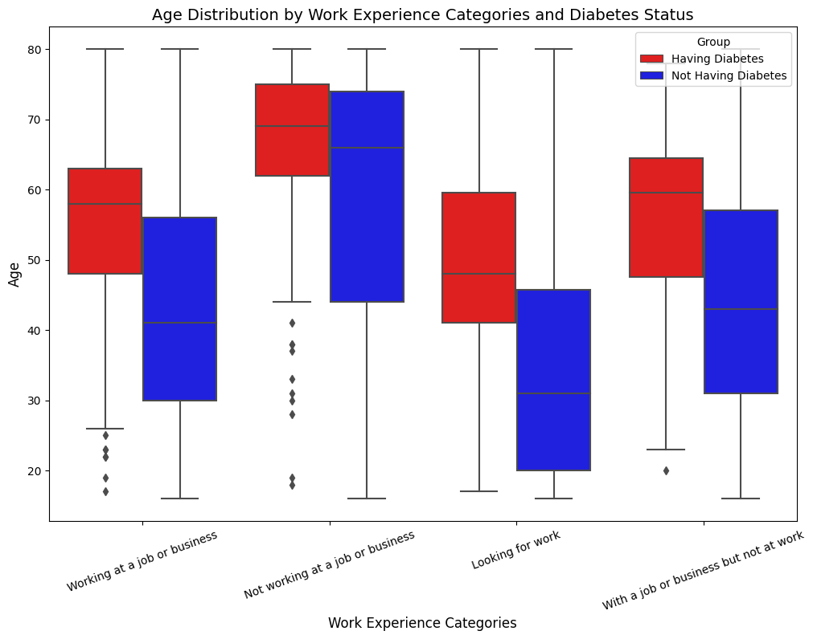

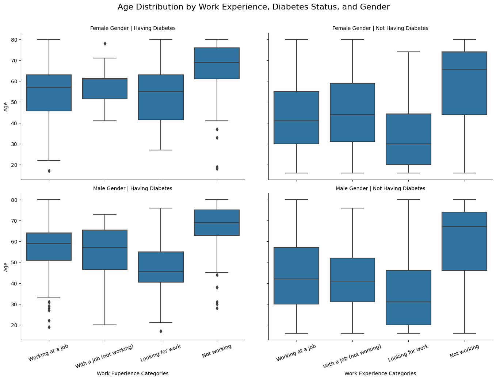

#### Working Hours

Woking hours does not have much influence.
- Mean working hours of a person having diabetes = 38.465 hrs
- Mean working hours of a person not having diabetes = 38.667 hrs
- Average working days for people with diabetes in a week: 4.83
- Average working days for people without diabetes in a week: 4.81

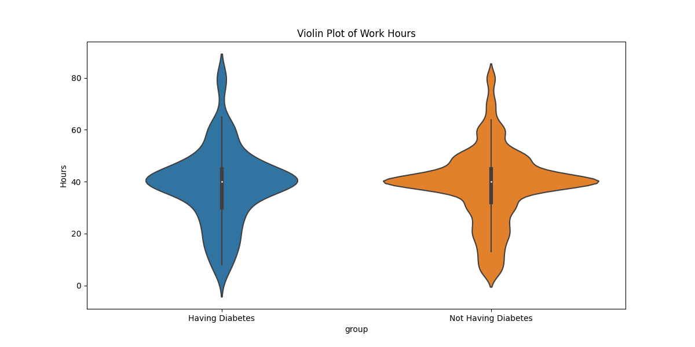


#### Reasons of not working last week 

- Percentage of people with diabetes who are not working because of health issues:  31.32%

- Percentage of people without diabetes who are not working because of health issues:  16.84%

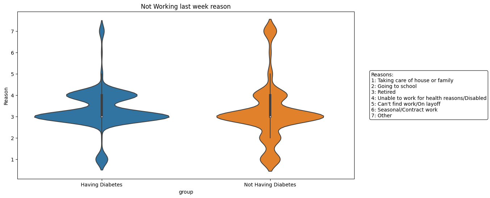


### Blood Pressure and Cholesterol

 - 72.041% of individuals with diabetes have been informed about hypertension.
 - Only 28.44% of individuals with no diabetes have been informed about hypertension.

 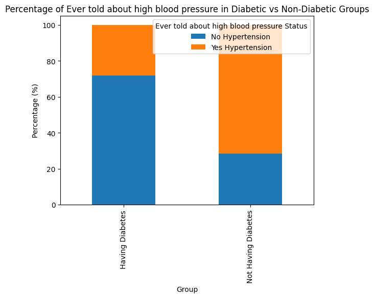

 - 70.8% of individuals with diabetes have been informed about cholesterol.
 - Only 30.58% of individuals with no diabetes have been informed about hypertension.

 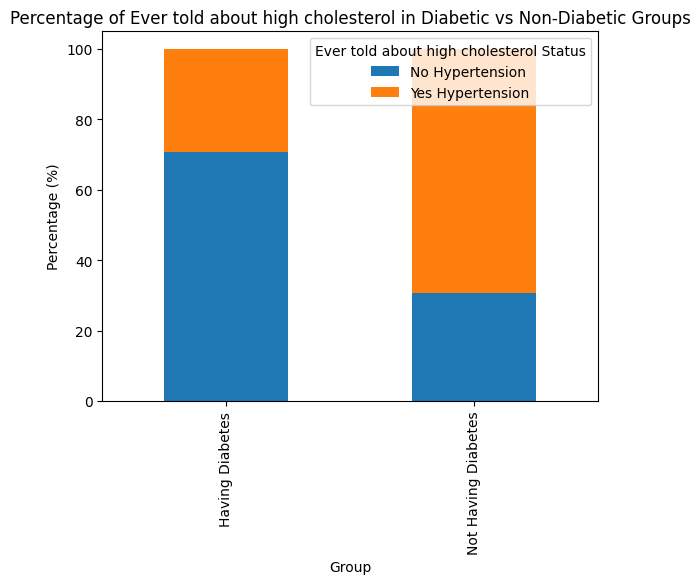

#### Blood pressure medication

- Proportion of People with diabetes who are taking blood pressure medication: 0.9094
- Proportion of People without diabetes who are taking blood pressure medication: 0.7932

#### Do they Smoke now ?     

|           |       Diabetic           |     Non-Diabetic       |
|-----------|---------------------|--------------|
|  Every day |0.2514           | 0.3067     |
|  Some days	 | 0.0646         | 0.0757     |
|  Not at all		 | 0.6839         | 0.6175     |

- Smoking data have a lot of missing values.

### Hearing Condition

- Diabetic Patients suffer from hearing problems more as compare to healthy patients as depicted in the figure below and also in article [link](https://www.cdc.gov/diabetes/diabetes-complications/diabetes-and-hearing-loss.html#:~:text=Low%20blood%20sugar%20over%20time,same%20age%20who%20don't.).

 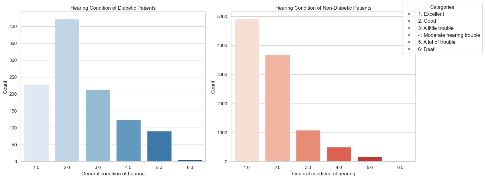

 ### General Health Condition

 -  The general health condition of most of the diabetic patients is not so good when we compare it with non-diabetic persons.

   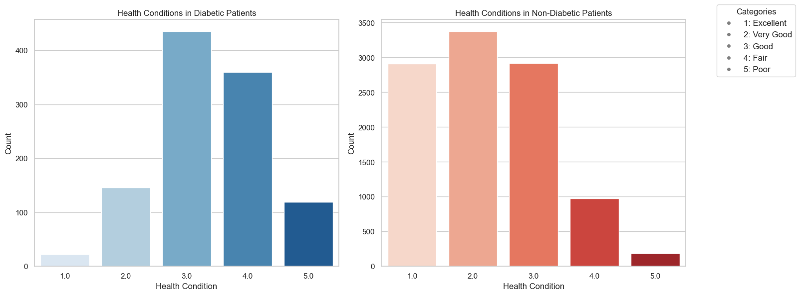


## Preprocessing Steps

- **Removed columns** with more than 30% missing (NaN) values.
- **Replaced** entries labeled as 'Refused' and 'Don't know' with NaN values.
- **Filled missing values in continuous variables** using the iterative imputer.
- **Imputed missing values in categorical variables** using the nearest neighbor imputation method.
- **Converted categorical variables** into one-hot encoded features.
- **Created new features**:
  - BMI (Body Mass Index)
  - Weight Difference in a Year
  - Total Physical Activity Hours

- **Selected features** for modeling: Race,  Gender, Age, Sample Weight, Sample Weight 2, HearingStatus_NoAid, EverTold_Hypertension, EverTold_HighCholesterol, CurrentlyTaking_CholesterolMedication, GeneralHealth_Status, WorkExperience_LastWeek, SmokedAtLeast100CigarettesInLife, EverHad_Alcohol, SittingTime_TypicalDay, WeekdaySleepHours, AlcoholConsumptionFrequency_12Months, BMI, Weight Difference in a Year, Total Physical Activity Hours.

- **Visualization**:
  - Applied **PCA** to reduce the dataset to 15 dimensions.
  - Generated a **t-SNE** plot on the transformed data for visualizing the high-dimensional feature space.

   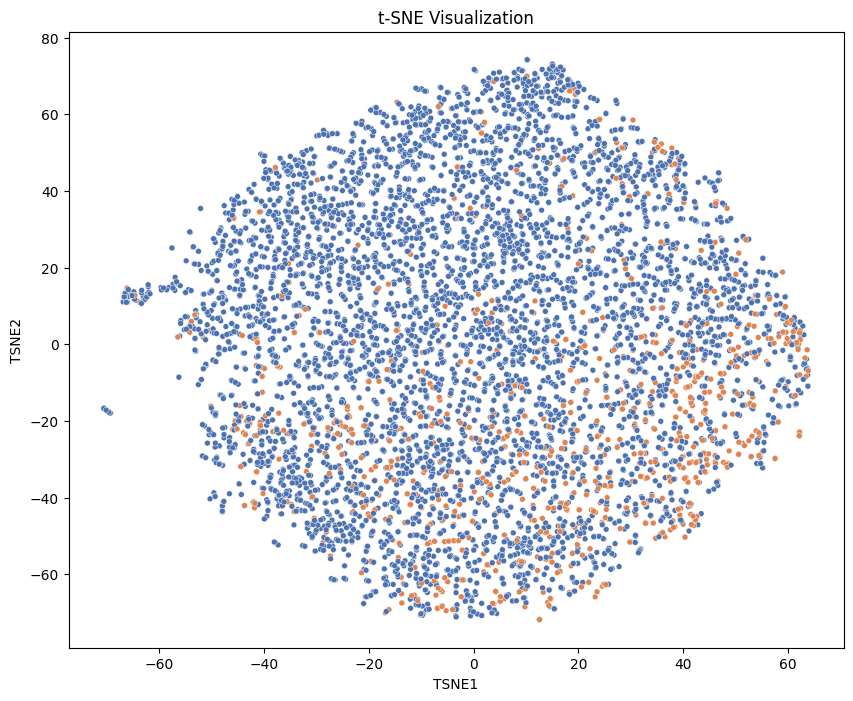


## Results 

5-fold cross validation is applied to calculate the accuracy and AUROC.

| Model                | No Sampling         | Oversampling - Borderline SMOTE | Oversampling - ADASYN | Oversampling - RandomOverSampler | Undersampling - TomekLinks | Hybrid - SMOTE+Tomek |
|----------------------|---------------------|----------------------------------|------------------------|----------------------------------|----------------------------|------------------------|
|                      | Acc.  | AUROC       | Acc.  | AUROC                        | Acc.  | AUROC        | Acc.  | AUROC                        | Acc.  | AUROC              | Acc.  | AUROC          |
| **Logistic Regression** | 77.23 | 0.8610  | 78.23 | **0.8579**                   | 76.87 | **0.8585**  | 77.16 | **0.8600**                   | 76.89 | 0.8607             | 77.72 | **0.8589**     |
| **SVM (Linear)**       | 87.01 | 0.8587  | 78.28 | 0.8558                        | 76.87 | 0.8557     | 77.33 | 0.8572                        | 87.06 | 0.8591             | 77.44 | 0.8556         |
| **SVM (Rbf)**          | 87.13 | 0.8544  | 77.47 | 0.8520                        | 76.15 | 0.8532     | 76.46 | 0.8555                        | 86.68 | 0.8538             | 76.97 | 0.8534         |
| **XGBoost**            | 86.37 | 0.8406  | 86.52 | 0.8400                        | 86.10 | 0.8384     | 84.67 | 0.8410                        | 86.32 | 0.8423             | 86.50 | 0.8399         |
| **Random Forest**      | 87.16 | **0.8616**  | 86.24 | 0.8583                   | 86.63 | 0.8575     | **86.37** | 0.8569                   | **87.44** | 0.8601             | 86.47 | 0.8561         |
| **Light GBM**         | **87.42** | 0.8614  | **86.90** | 0.8536                   | **87.08** | 0.8522  | 78.93 | 0.8546                   | 87.32 | **0.8613**             | **86.81** | 0.8533         |
